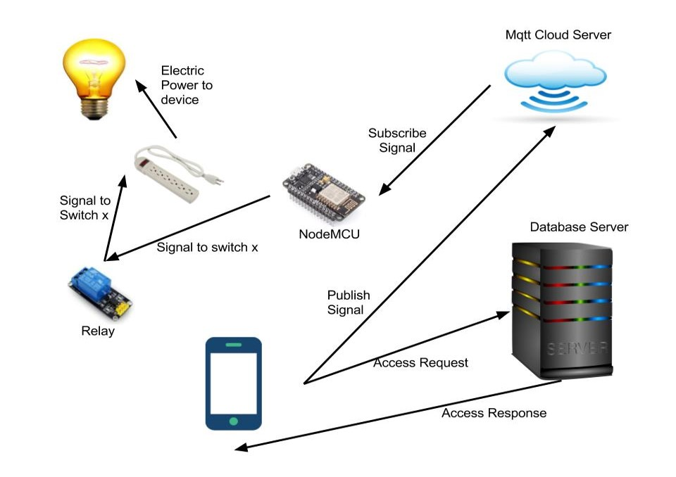

# Smart-Switch
An android application to control switch board. 

## Problem Statement
Did you ever wish,
- A geyser turning on automatically for 10 min after your morning alarm
- A bulb that brights up the room automatically, to stop you from snoozing alarm indefinitely
- A battery charger that disconnects itself after an hour, to prevent overcharging
- A way to turn off a switch that you forgot to but recalled later when you are no longer in the vicinity 

There are endless such requirements where you want to control a device remotely and set automatic daily schedules or on demand schedules for each device. This not only saves time, but also improves durability of devices by preventing possible damages that could happen if devices are left on for a long time.

## Solution
- An Arduino board is connected to switches and is installed with a software that can receive commands from a remote Mqtt Cloud Server and then operate switches based on the commands. 
- A remote database to store all the schedules and manage access permissions.
- An Android Application to provide an interface for users to manage devices. It primarily converts user inputs into commands which are sent to the Mqtt Cloud Server. It also makes use of the remote database to enforce access control and ensures that schedules don't overlap.  

## Features
- Switching on and off - The switches can be set on or off remotely by the mobile app.
- Multiple task scheduling - Multiple users can set multiple tasks.
- Setting up a timer - Timer can be set on any of the switches to which a user has access.
- Access control - The product can be used by multiple users and access can be controlled by an admin. No two users are allowed to set a timer on the same switch for the same time interval.
- Real time status of the switches - The status of all the switches can be seen in the mobile application by a user so that he can know when to switch on or set a timer on a switch.

## Advantages
- The device can be used along with existing switchboards with very minimal changes 
- The additional hardware required is minimal (a NodeMCU and a Relay)
- The cost is very low. (NodeMCU costs around Rs.400 and Relays around Rs.100).  

## High Level Design  

## Demo  

### Switch On Off  

### Timer  

